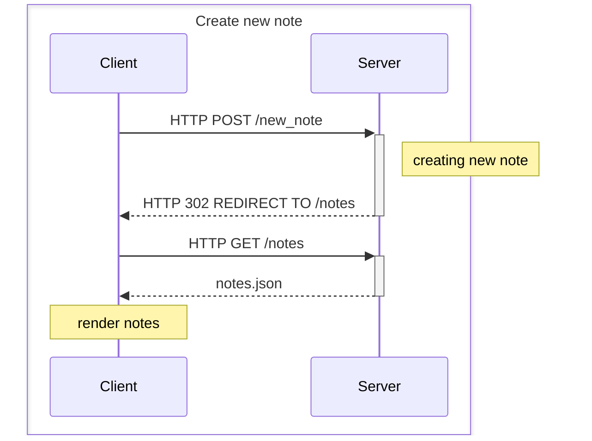

```mermaid
sequenceDiagram
box Create new note
participant Client
participant Server
end
Client ->>+ Server: HTTP POST /new_note
Note right of Server: creating new note
Server -->>- Client: HTTP 302 REDIRECT TO /notes
Client ->>+ Server: HTTP GET /notes
Server -->>- Client: notes.json
Note over Client: render notes
```
