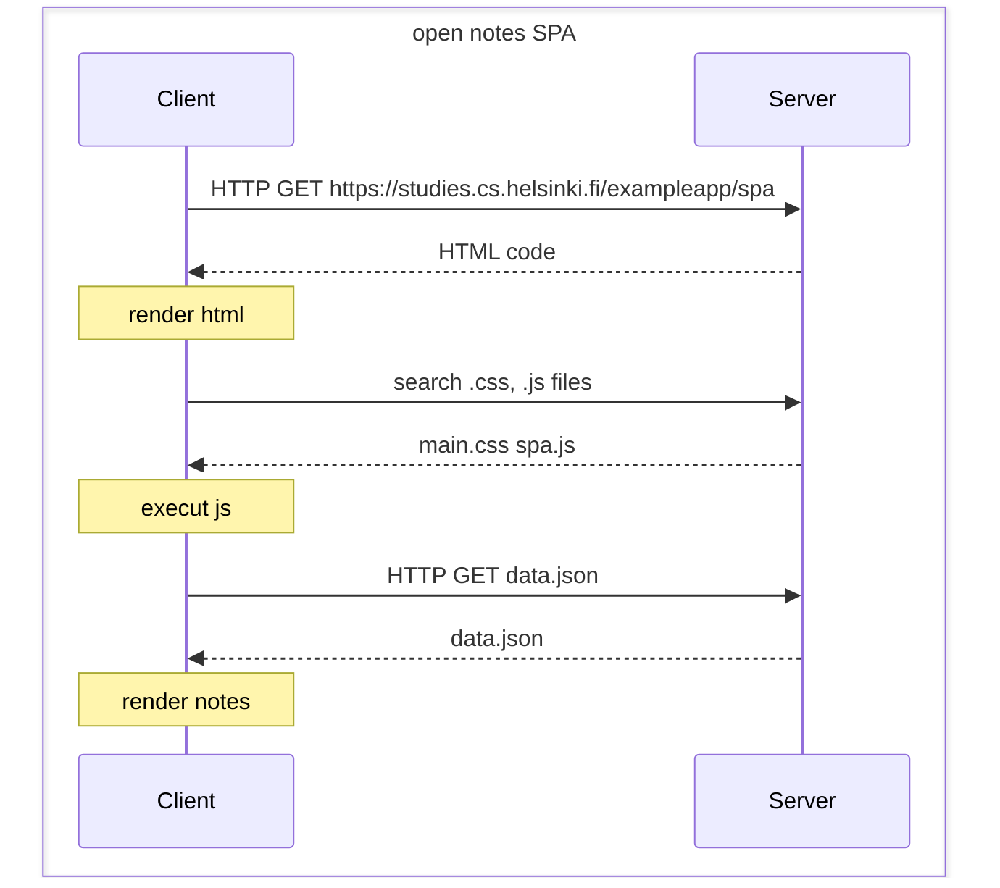

```mermaid
sequenceDiagram
box open notes SPA
participant Client
participant Server
end
Client ->> Server: HTTP GET https://studies.cs.helsinki.fi/exampleapp/spa
Server -->> Client: HTML code
Note over Client: render html
Client ->> Server: search .css, .js files
Server -->> Client: main.css spa.js
Note over Client: execut js
Client ->> Server: HTTP GET data.json
Server -->> Client: data.json
Note over Client: render notes
```
