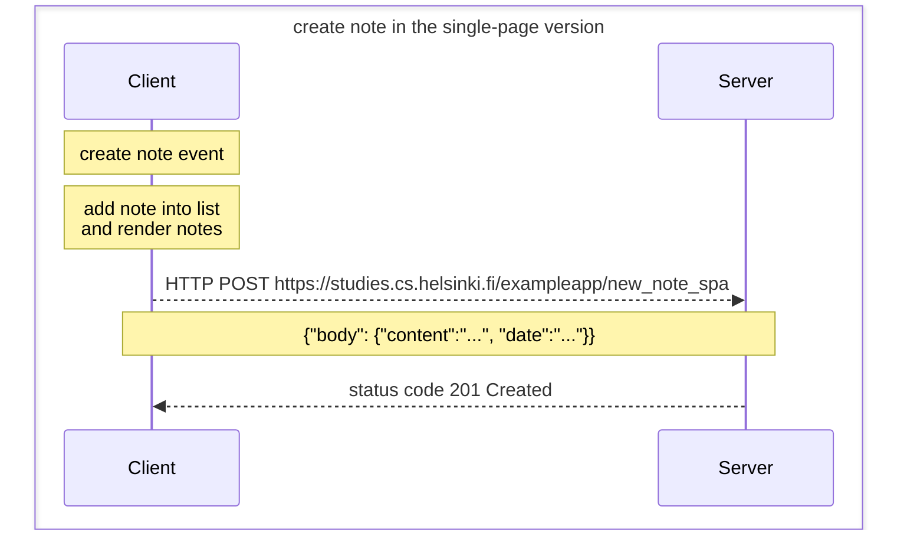

```mermaid
sequenceDiagram
box create note in the single-page version
participant Client
participant Server
end
Note over Client: create note event
Note over Client: add note into list <br> and render notes
Client -->> Server: HTTP POST https://studies.cs.helsinki.fi/exampleapp/new_note_spa
Note over Client,Server : {"body": {"content":"...", "date":"..."}}
Server -->> Client: status code 201 Created
```
